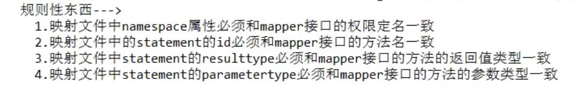

## 当出现要获取最近插入数据的自增id

```xml
<selectKey order="after">select last_inset_id() </selectKey>
```

## mybatisConfig.xml 

properties 别名

```xml
<properties resourse="student.properties"></properties>
后面可以使用${student.name}
```

```xml
<typeAliases>
  <package name="com.xian.entity"></package>
</typeAliases>
后面returnType就可以省略前面的包名了
```

## sqlSession的getMapper代理对象

实现了上层对 sqlsession的封装

