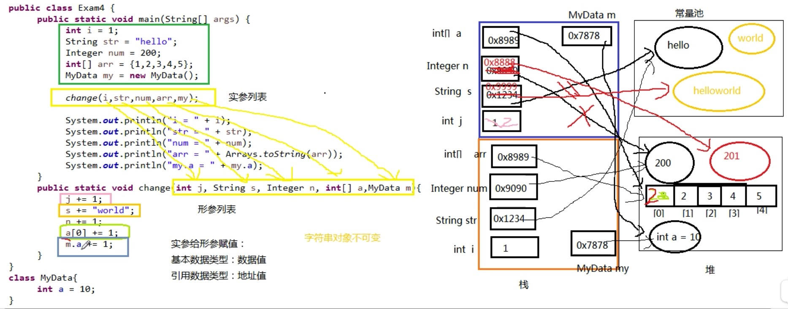
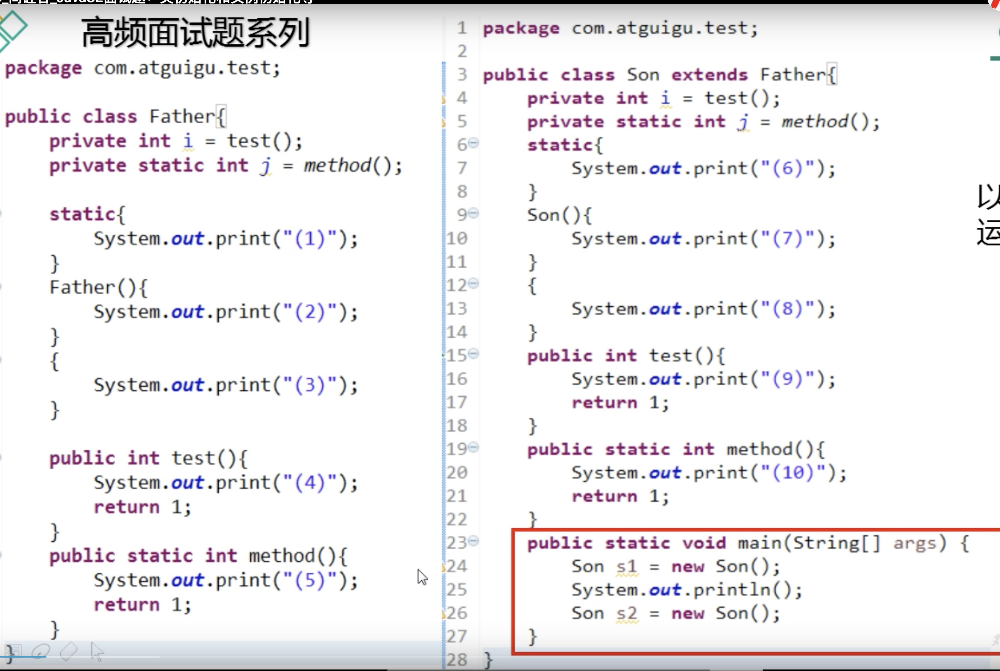
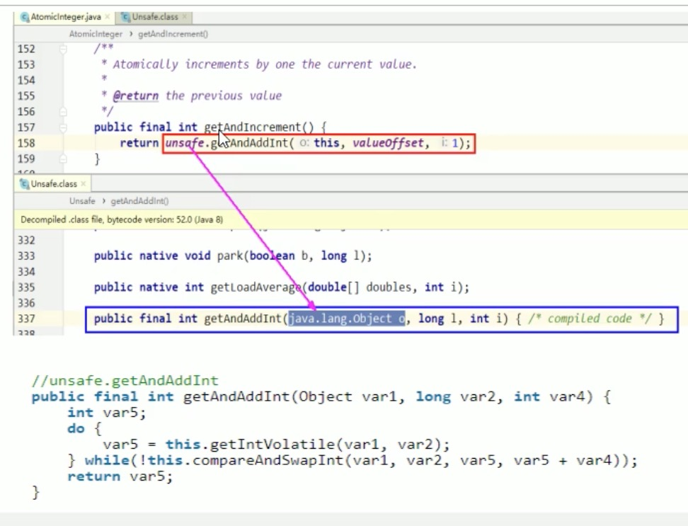
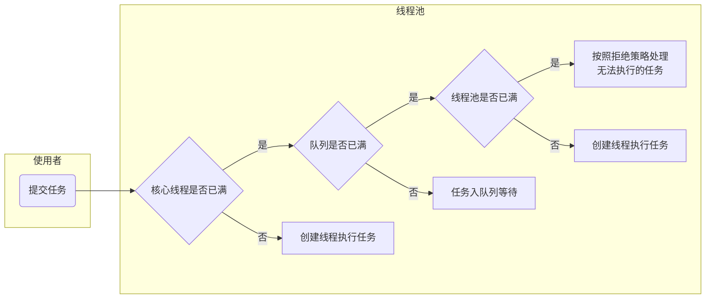
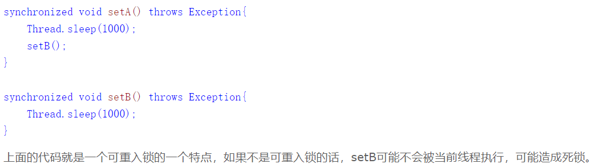

# JAVA基础

## 基础

#### Java中有全局变量吗


#### 单例设计模式

1. 一个类只能有一个实例
   1. 构造器私有化
2. 必须自行创建这个实例
   1. 含有一个该类的静态变量来保存这个唯一实例
3. 必须自行向整个系统提供这个实例
   1. 两种方式
      1. 直接暴露 
      2. 用静态变量的get方法获取

两种方式

1. 饿汉式 直接创建实例对象 不存在线程安全问题

   1. 直接创建(不管需不需要实例化 都会创建）

      ```java
      public class Singleton1 {
          public static final Singleton1 INSTANCE = new Singleton1();
          private Singleton1(){
          }
      }
      ```

   2. 枚举类型 表示该类型对象是有限的几个 我们可以限定为1个 就成了单例

      ```java
      public enum  Singleton2 {
          INSTANCE;
      }
      ```

   3. 静态代码块(可以根据加载类位置中的配置文件的信息)

      ```java
      public class Singleton3 {
          public static final Singleton3 INSTANCE;
          static {
              INSTANCE = new Singleton3();
          }
          private Singleton3(){
      
          }
      }			
      ```

2. 懒汉式(延迟创建)

   1. 线程不安全(适用于单线程)

      ```java
      public class Singleton4 {
          private static Singleton4 INSTANCE;
          private Singleton4(){
      
          }
          public static Singleton4 getInstance(){
             if (INSTANCE==null)
               //1
                 INSTANCE = new Singleton4();
             return INSTANCE;
          }
      }
      //两个线程在判断玩Instance==null之后 
      //在1的位置 写入了其他代码
      //导致线程1在运行结束 执行new方法之前
      //线程2已结开始判断Instance==null 并且进入1代码区的执行
      //最后两个线程都执行了一遍new方法
      ```

   2. 线程安全(适用于多线程)

      ```java
      public class Singleton4 {
        //这里Instance加上volatile目的是禁止指令重排
        //new Singleton4()有三部
        //1.分配对象内存空间
        //2.初始化对象
        //3.将Instance指向分配的对象内存
        //但是此时如果编译器指令重排 将2与3交换 那么可能导致其他线程获取对象实例的时候 对象未初始化
        //所以要加上volatile禁止指令重排
          private static volatile Singleton4 INSTANCE;
          private Singleton4(){
      
          }
          public static Singleton4 getInstance(){
            //双端检索 两次if判断
              if (INSTANCE==null) {
                  synchronized (Singleton4.class) {
                   if (INSTANCE == null) INSTANCE = new Singleton4();
                      return INSTANCE;
               }
              }
              return INSTANCE;
          }
      }
      ```
   
   3. 静态内部形式(适用于多线程)
   
      ```java
      public class Singleton5 {
          private Singleton5(){}
          private static class Inner{
              private static final Singleton5 INSTANCE = new Singleton5();
          }
      
          public static Singleton5 getInstance() {
              return Inner.INSTANCE;
          }
      }
      /*
      在内部类被加载和初始化的时候，才创建INSTANCE实例对象
      静态内部类不会自动随着外部类的加载和初始化而初始化，他们需要单独的去加载和初始化
      因为在内部类加载和初始化时创建的 所以是线程安全的
      */
      ```

#### 运算操作顺序

```java
int i=1;
i = i++;
int j=i++;
int k=i+ ++i*i++;
//i=4 j=1 k=11
```

赋值=最后计算 由操作数栈的值 修改回局部变量表

=号右边的自左到右依次压入操作数栈

实际先算哪个，看运算符先后顺序

i++ i— i+=2 i-=1这种都是iinc 不涉及操作数栈

压入入操作数栈的不会因为局部变量表的改变而修改

遇到 = 存回的时候会修该局部变量表的值


#### final关键字，final修饰的方法不能被重写，能被重载吗？

（在这里额外提了Java内存模型对于final的底层实现）


#### String类

String 类是final类，不可以被继承

```java
//代码1  
String sa = "ab";                                          
String sb = "cd";                                       
String sab=sa+sb;                                      
String s="abcd";  
System.out.println(sab==s); // false  
//代码2  
String sc="ab"+"cd";  
String sd="abcd";  
System.out.println(sc==sd); //true 
```

代码1中局部变量sa,sb存储的是堆中两个拘留字符串对象的地址。

** 而当执行sa+sb时，JVM首先会在堆中创建一个StringBuilder类，同时用sa指向的拘留字符串对象完成初始化，然后调用append方法完成对sb所指向的拘留字符串的合并操作，接着调用StringBuilder的toString()方法在堆中创建一个String对象，最后将刚生成的String对象的堆地址存放在局部变量sab中。**

而局部变量s存储的是常量池中"abcd"所对应的拘留字符串对象的地址。 sab与s地址当然不一样了。这里要注意了，代码1的堆中实际上有五个字符串对象：三个拘留字符串对象、一个String对象和一个StringBuilder对象。


代码2中"ab"+"cd"会直接在编译期就合并成常量"abcd"， 因此相同字面值常量"abcd"所对应的是同一个拘留字符串对象，自然地址也就相同。

```java
String a = "hello2";
String b = "hello" + 2;
System.out.println((a == b));
//true
```


```java
String a = "hello2"; 　  
String b = "hello";      
String c = b + 2;       
System.out.println((a == c));
//false
```


```java
String a = "hello2";   　 
final String b = "hello";       
String c = b + 2;       
System.out.println((a == c));
//true 
```

对于被final修饰的变量，会在class文件常量池中保存一个副本，也就是说不会通过连接而进行访问，对final变量的访问在编译期间都会直接被替代为真实的值。


```java
public class Main {
    public static void main(String[] args) {
        String a = "hello2";
        final String b = getHello();
        String c = b + 2;
        System.out.println((a == c));
    }
     
    public static String getHello() {
        return "hello";
    }
}
//false
```

输出结果为false。这里面虽然将b用final修饰了，但是由于其赋值是通过方法调用返回的，那么它的值只能在运行期间确定，因此a和c指向的不是同一个对象。

```java
public class Main {
    public static void main(String[] args) {
        String a = "hello";
        String b =  new String("hello");
        String c =  new String("hello");
        String d = b.intern();
         
        System.out.println(a==b);//false
        System.out.println(b==c);//false
        System.out.println(b==d);//false
        System.out.println(a==d);//true
    }
}
```

```java
public class Main {
    public static void main(String[] args) {
        String str1 = "I";
        //str1 += "love"+"java";        1)
        str1 = str1+"love"+"java";      //2)
         
    }
}
```

#### 传参原则



#### int和Integer

拆箱和装箱

```java
class AutoUnboxingTest {
    public static void main(String[] args) {
        Integer a = new Integer(3);
        Integer b = 3;                  // 将3自动装箱成Integer类型
        int c = 3;
        System.out.println(a == b);     // false 两个引用没有引用同一对象
        System.out.println(a == c);     // true a自动拆箱成int类型再和c比较
    }
}
```

```java
public class Test03 { 
    public static void main(String[] args) {
        Integer f1 = 100, f2 = 100, f3 = 150, f4 = 150;
        System.out.println(f1 == f2);//true
        System.out.println(f3 == f4);//false
    }
}
```

首先需要注意的是f1、f2、f3、f4四个变量都是Integer对象引用，所以下面的==运算比较的不是值而是引用。装箱的本质是什么呢？当我们给一个Integer对象赋一个int值的时候，会调用Integer类的静态方法valueOf，如果看看valueOf的源代码就知道发生了什么。

```java
public static Integer valueOf(int i) {
    if (i >= IntegerCache.low && i <= IntegerCache.high)
        return IntegerCache.cache[i + (-IntegerCache.low)];
    return new Integer(i);
}
```

简单的说，如果整型字面量的值在-128到127之间，那么不会new新的Integer对象，而是直接引用常量池中的Integer对象，所以上面的面试题中f1==f2的结果是true，而f3==f4的结果是false。

#### 为什么 2-1.1 = 0.8999999999999

浮点数值采用二进制系统表示，而二进制系统无法精确表示分时1/10，类似十进制无法精确表示1/3，想要计算结果没有任何舍入误差，应该使用BigDecimal类表示。


#### byte[] 转long int

注意位移的时候 要 &0xff 保持高位置0 

byte转int 负数高位补1

所以先将byte&0xff 保证高位为0之后 在进行左移

否则左移之后 左边余位全为1

加法原理是补码相加 一个字节为数值 其他字节全为0即可

```java
public static int byteArrayToInt(byte[] bytes) {
        int value=0;
        for(int i = 0; i < 4; i++) {
            int shift= (3-i) * 8;
            System.out.println(Integer.toBinaryString((bytes[i])<< shift));
            value +=(bytes[i] & 0xFF) << shift;
        }
        return value;
    }
```

#### byte 转 long int

都是补码形式存储 byte是8位形式存储 long是8字节64位 int是4字节32位

int long转byte取低八位 作为补码直接存进去

byte转int long  负数高位补1 ()

```java
public static byte[] intToByteArray(int i) {
        byte[] result = new byte[4];
        result[0] = (byte)((i >> 24) & 0xFF);
        result[1] = (byte)((i >> 16) & 0xFF);
        result[2] = (byte)((i >> 8) & 0xFF);
        result[3] = (byte)(i & 0xFF);
        return result;
    }
```

#### static


#### **short s1 = 1; s1 = s1 + 1;有错吗?short s1 = 1; s1 += 1;有错吗？**

* 对于short s1 = 1; s1 = s1 + 1;由于1是int类型，因此s1+1运算结果也是int 型，需要强制转换类型才能赋值给short型。
* short s1 = 1; s1 += 1;可以正确编译，因为s1+= 1;相当于s1 = (short)(s1 + 1);其中有隐含的强制类型转换。


#### Java 里面的 clone

clone其实是Object类实现的

Clonable只是一个标志性接口 里面没有方法


#### 接口和抽象类

| 参数               | 抽象类                                                       |                                                              |
| ------------------ | ------------------------------------------------------------ | ------------------------------------------------------------ |
| 默认的方法实现     | 允许有默认的方法实现                                         | 完全抽象，不允许                                             |
| 实现               | extends继承抽象类，若子类不是抽象类，则必须实现所有的抽象类中的方法 | implements实现接口，提供所有声明方法的实现                   |
| 构造器             | 可以有构造器                                                 | 不能                                                         |
| 与正常java类的区别 | 除了不能实例化之外，它和java普通类没区别                     | 接口是完全不同的类型                                         |
| 访问修饰符         | 可以public、protected和default这些修饰符                     | 默认修饰符是public 不可以使用其它修饰符 内置变量会被默认声明为 public static final |
| main方法           | 可以有main方法 并且可以运行                                  | 没有                                                         |
| 多继承             | 可以继承一个类 多个接口抽象类可继承具体类也可以继承抽象类    | 只能继承一个或者多个接口                                     |
| 速度               | 它比接口速度要快                                             | 接口是稍微有点慢的，因为它需要时间去寻找在类中实现的方法。   |
| 添加新方法         | 如果你往抽象类中添加新的方法，你可以给它提供默认的实现。因此你不需要改变你现在的代码 | 如果你往接口中添加方法，那么你必须改变实现该接口的类         |


#### string，stringbuilder，stringbuffer比较

String(大姐，出生于JDK1.0时代)          不可变字符序列
StringBuffer(二姐，出生于JDK1.0时代)    线程安全的可变字符序列
StringBuilder(小妹，出生于JDK1.5时代)   非线程安全的可变字符序列 

stringbuilder和stringbuffer都继承了AbstractStringBuilder

append方法的源码是

首先用Array.copyof实现数组的扩容

然后用String.getChars()实现对新数组尾部的写入


StringBuffer的很多方法都被关键字**synchronized** 修饰了，而StringBuilder没有


#### equals() 和 ==

1. 如果两个对象相同（equals方法返回true），那么它们的hashCode值一定要相同
2. 如果两个对象的hashCode相同，它们并不一定相同。

区别

* "=="
  1. 如果作用于基本数据类型的变量，则直接比较其存储的 “值”是否相等
  2. 如果作用于引用类型的变量，则比较的是所指向的对象的地址
* equals
  1. 如果没有对equals方法进行重写，则比较的是引用类型的变量所指向的对象的地址
  2.  诸如String、Date等类对equals方法进行了重写的话，比较的是所指向的对象的内容(程序员自己定义)


#### 什么不能根据返回类型来区分重载

因为在jvm中方法的重载除了要一个与原方法相同的简单名称之外，还要一个与原方法不同的特征签名。

这个特征签名就是这个方法各个参数在常量池中的符号引用的集合，不包含返回值。


#### 内部类

内部类作用：

1. 可以访问该类定义的作用域内的所有数据，包括私有数据(通过调用一个对外围类的隐式引用 outer.xxx)
2. 可以对同一个包内的其他类隐藏

## 集合

#### 线程不安全问题

* list -> CopyOnWriteArrayList
* set -> CopyOnWriteSet
* map -> ConcorrentHashMap

### lambda对Java到底是好是坏


#### Java map底层实现


#### HashMap


#### HashSet

底层使用Hashmap实现的

add方法就是Hashmap的put方法 

add的值就是key 

value是恒定的 是一个叫present的object类型的常量


#### ConcurrentHashMap


### hashtable


#### 散列表（哈希表）


## Gc

### 概念

#### 什么时候会导致垃圾回收

1. 排查内存溢出
2. 排查内存泄漏
3. 性能调优，排查并发瓶颈

> **GC**目的：回收堆内存中不再使用的对象，释放资源
>  回收时间：当对象永久地失去引用后，系统会在合适的时候回收它所占的内存。
>
> 另一种更详细一点**GC**时间的说法就是：
>  1、当应用程序分配新的对象，GC的代的预算大小已经达到阈值，比如GC的第0代已满
>  2、代码主动显式调用System.GC.Collect()
>  3、其他特殊情况，比如，windows报告内存不足、CLR卸载AppDomain、CLR关闭，甚至某些极端情况下系统参数设置改变也可能导致GC回收

#### Gc是怎么运行的

1. 标记
2. 计划 
3. 清理

#### 新老以及永久区是什么

新区和老区指的是java堆

java堆被分为新生代和老年代。新生代又被分为一个**Eden**和两个**Survivor**，一个**From Survivor**、一个**To Survivor ****(复制算法)**

永久区用来存放方法区（存放了要加载的类信息、静态变量、final类型的常量、属性和方法信息）

#### Gc 有几种方式？怎么配置？

##### Gc算法

1. 标记-清除
2. 复制
3. 标记-整理

##### 收集器

1. Serial
2. ParNew
3. Parallel Scavenge
4. CMS
5. G1

#### 什么时候一个对象会被GC？如何判断一个对象是否存活?

1. 引用计数法

   在对象上添加一个引用计数器，每当有一个对象引用它时，计数器加1，当使用完该对象时，计数器减1，计数器值为0的对象表示不可能再被使用。引用计数法实现简单，判定高效，但不能解决对象之间相互引用的问题

2. 可达性分析法

   通过一系列称为 “GC Roots” 的所有对象作为起点，从这些节点开始向下搜索，搜索路径称为 “引用链”。

   以下对象可作为GC Roots：

   1. 本地变量表中引用的对象(栈)
   2. 方法区中静态变量引用的对象
   3. 方法区中常量引用的对象
   4. Native方法引用的对象

#### System.gc() Runtime.gc()会做什么事情？能保证 GC 执行吗？

两者基本无区别 知识Runtime.gc()需要一个instance

不会当你调用System.gc()就会进行gc

程序员可以手动执行`System.gc()`，通知GC运行，但是Java语言规范并不保证GC一定会执行

#### Minor GC 、Major GC、Young GC 与 Full GC分别在什么时候发生?

* Minor Gc 指的是新生代的垃圾收集操作，所有Minor Gc都会暂停应用程序的线程

  > 新生代通常存活时间较短基于Copying算法进行回收，所谓Copying算法就是扫描出存活的对象，并复制到一块新的完全未使用的空间中，对应于新生代，就是在Eden和FromSpace或ToSpace之间copy。新生代采用空闲指针的方式来控制GC触发，指针保持最后一个分配的对象在新生代区间的位置，当有新的对象要分配内存时，用于检查空间是否足够，不够就触发GC。当连续分配对象时，对象会逐渐从Eden到Survivor，最后到老年代。

* Major GC 指的是老年代的垃圾收集操作

  > 老年代与新生代不同，老年代对象存活的时间比较长、比较稳定，因此采用标记(Mark)算法来进行回收，所谓标记就是扫描出存活的对象，然后再进行回收未被标记的对象，回收后对用空出的空间要么进行合并、要么标记出来便于下次进行分配，总之目的就是要减少内存碎片带来的效率损耗和大对象无法存储

#### 如果对象的引用被置为null，垃圾收集器是否会立即释放对象占用的内存？

不会，会等到下一个垃圾回收周期


#### JVM的永久代中会发生垃圾回收吗

> 很多人认为方法区 (或者 HotSpot 虚拟机中的永久代) 是没有垃圾收集的，但是并不是没有，只是在方法区中进行垃圾收集的“性价比”一般比较低 ，而在堆中，尤其是在新生代中，常规应用进行一次垃圾收集一般可以回收 70% ~ 95% 的空间，而永久代的垃圾收集效率远低于此。
>
> **永久代的垃圾收集主要回收两部分内容 : 废弃常量和无用的类**。回收废弃常量与回收Java 堆中的对象非常类似。以常量池中字面量的回收为例，假如一个字符串“abc”已经进入了常量池中，但是当前系统没有任何一个String 对象是叫做“abc”的，换句话说，就是没有任何 String 对象引用常量池中的“abc”常量，也没有其他地方引用了这个字面量，如果这时发生内存回收，而且必要的话，这个“abc”常量就会被系统清理出常量地。常量池中的其他类(接口)、方法、字段的符号引用也与此类似。判定一个常量是否是“废弃常量”比较简单，而要判定一个类是否是“无用的类”的条件则相对苛刻许多。类需要同时满足下面 3 个条件才能算是"无用的类":
>
> - 该类所有的实例都已经被回收，也就是 Java 堆中不存在该类的任何实例。
> - 加载该类的 ClassLoader 已经被回收。
> - 该类对应的 java.lang.Class 对象没有在任何地方被引用，无法在任何地方通过反射访问该类的方法。
>
> 虚拟机可以对满足上述 3 个条件的无用类进行回收，这里说的仅仅是“可以” 。而并不是和对象一样，不使用了就必然会回收。
>
> 是否对类进行回收，HotSpot 虚拟机提供了 `-Xnoclassgc` 参数进行控制，还可以使用 `-verbose:class` 以及 `-XX:HTraceClassLoading`、`-XX:HTraceClassUnLoading` 查看类加载和印载信息。

### Gc收集器

#### 垃圾回收器的基本原理是什么？

垃圾回收器是一个级别很低的守护线程,它通过不定时监测程序使用的内存中被占用的动态分配的内存内的对象是否还存在它的引用来判断是否该回收那个内存单元,如果不存在则回收,否则相反~~并不是只要监测到就会回收的,因为垃圾回收器线程的低级别,所以当另一个级别比它高的线程跟他同时竞争运行时间时,前者优先运行,所以你无法知道垃圾回收器何时回收,System.gc()只是建议垃圾回收器进行回收处理,调用它并不能保证它回立即回收。

#### Serial 与 Parallel GC之间的不同之处

| Serial             | Parallel GC                      |
| ------------------ | -------------------------------- |
| 注重低停顿时间     | 注重CPU效率                      |
| 单线程             | 多线程并行                       |
| 多用于client机器上 | 在后台运算而不需要太多的交互任务 |

#### CMS 收集器 与 G1 收集器的特点与区别


#### 吞吐量优先和响应优先的垃圾收集器选择？选择一个GC策略？

和用户交互比较多的遵循响应优先，提高用户体验。

吞吐量则可以高效率地利用CPU 时间，尽快完成程序的运算任务，主要适合在后台运算而不需要太多交互的任务


## JVM

### 参数

#### 说说你知道的几种主要的jvm 参数

* -XX:MaxGCPauseMills 
  * 最大停顿时间 
  * 单位毫秒

* -XX:GCTimeRatio 
  * 0-100的取值范围
  * 垃圾收集时间占总时间的比
  * 默认99，即最大允许1%时间做GC
  * 计算吞吐量
* -XX:ParallelGCThreads=8
  * Gc并行线程数
* -XX:SurvivorRatio=8
  * 新生代中 Surviver和Eden的比例
* -XX:+DisableExplicitGC
  * 不允许显示调用System.gc()

> 推荐文章  <https://www.cnblogs.com/redcreen/archive/2011/05/04/2037057.html>

> ```
> -server -Xmx3g -Xms3g -XX:MaxPermSize=128m 
> -XX:NewRatio=1  eden/old 的比例
> -XX:SurvivorRatio=8  s/e的比例 
> -XX:+UseParallelGC 
> -XX:ParallelGCThreads=8  
> -XX:+UseParallelOldGC  这个是JAVA 6出现的参数选项 
> -XX:LargePageSizeInBytes=128m 内存页的大小， 不可设置过大， 会影响Perm的大小。 
> -XX:+UseFastAccessorMethods 原始类型的快速优化 
> -XX:+DisableExplicitGC  关闭System.gc()
> 
> -Xms / -Xmx — 堆的初始大小 / 堆的最大大小
> -Xmn — 堆中年轻代的大小
> -XX:-DisableExplicitGC — 让System.gc()不产生任何作用
> -XX:+PrintGCDetails — 打印GC的细节
> -XX:+PrintGCDateStamps — 打印GC操作的时间戳
> -XX:NewSize / XX:MaxNewSize — 设置新生代大小/新生代最大大小
> -XX:NewRatio — 可以设置老生代和新生代的比例
> -XX:PrintTenuringDistribution — 设置每次新生代GC后输出幸存者乐园中对象年龄的分布
> -XX:InitialTenuringThreshold / -XX:MaxTenuringThreshold：设置老年代阀值的初始值和最大值
> -XX:TargetSurvivorRatio：设置幸存区的目标使用率
> ```


### 类加载机制

#### 类加载 类实例化 方法重写的顺序



**先记载类 然后初始化实例！！！**

类初始化原则(clinit)

* 创建实例 要首先加载并且初始化该类
* 子类的初始化要首先初始化父类
* 一个类的初始化就是执行clinit方法
  * clinit方法由 静态类变量 和 静态代码块组成 两者按顺序执行

实例初始化原则(init)

* init 方法可能有多个 几个构造器就有几个Init方法

* init方法构成

  * super （父类的init方法 最先执行）
  * 非静态实例变量赋值代码
  * 非静态代码块  (这两者按顺序执行)
  * 构造器代码(最后执行)

* ## 注意 父类方法如果被子类重写

5 1  (父类clinit方法)类加载class的初始化级阶段

10 6 (子类的clinit方法)类加载class的初始化级阶段


#### 双亲委派模型

#### Java 类加载器都些

1. bootstrap类加载器

   > 启动类加载器主要加载的是JVM自身需要的类，这个类加载使用C++语言实现的，是虚拟机自身的一部分，它负责将 `<JAVA_HOME>/lib`路径下的核心类库或`-Xbootclasspath`参数指定的路径下的jar包加载到内存中

2. extension类加载器

   > 扩展类加载器是指Sun公司(已被Oracle收购)实现的sun.misc.Launcher$ExtClassLoader类，由Java语言实现的，是Launcher的静态内部类，它负责加载<JAVA_HOME>/lib/ext目录下或者由系统变量-Djava.ext.dir指定位路径中的类库，开发者可以直接使用标准扩展类加载器。

3. system类加载器

   > 也称应用程序加载器是指 Sun公司实现的sun.misc.Launcher$AppClassLoader。它负责加载系统类路径java -classpath或-D java.class.path 指定路径下的类库，也就是我们经常用到的classpath路径，开发者可以直接使用系统类加载器，一般情况下该类加载是程序中默认的类加载器，通过ClassLoader#getSystemClassLoader()方法可以获取到该类加载器。 

#### JVM如何加载字节码文件

加载->连接(验证->准备->解析)->初始化->使用->卸载


### 内存管理

#### java的几种引用

- 强引用: `StrongReference`: 引用指向对象，类似`"Object obj = new Object();"`这类引用，`gc(Garbage Collection)`运行时不回收；
- 软引用: `SoftReference`: gc运行时**可能**回收(jvm内存不够(内存溢出异常))；
- 弱引用: `WeakReference `: 描述非必须对象，强度比软引用更加弱一些，被弱引用关联的对象只能生存到下一次垃圾回收之前，当垃圾回收器工作时，**无论当前内存是否足够**，都会回收掉这些被弱引用关联的对象(gc运行时回收)；
- 虚引用: `PhantomReference` 类似于无引用，主要跟踪对象被回收的状态，不能单独使用，必须与引用队列(ReferenceQueue)联合使用；

#### JVM内存分哪几个区，每个区的作用是什么

1. 堆。堆是Java对象的存储区域，任何用new字段分配的Java对象实例和数组，都被分配在堆上，Java堆可使用-Xms -Xmx进行内存控制，值得一提的是从JDK1.7版本之后，运行时常量池从方法区移到了堆上。
2. 方法区。它用于存储已被虚拟机加载的类信息，常量，静态变量，即时编译器编译后的代码等数据，方法区在JDK1.7版本及以前被称为永久代，从JDK1.8永久代被移除
3. 虚拟机栈。虚拟机栈中执行每个方法的时候，都会创建一个栈帧用于存储局部变量表，操作数栈，动态链接，方法出口等信息。
4. 本地方法栈。与虚拟机栈发挥的作用相似，相比于虚拟机栈为Java方法服务，本地方法栈为虚拟机使用的Native方法服务，执行每个本地方法的时候，都会创建一个栈帧用于存储局部变量表，操作数栈，动态链接，方法出口等信息。
5. 程序计数器。指示Java虚拟机下一条需要执行的字节码指令。 


#### 什么情况下会发生栈内存溢出

1. 栈内存从概念上分 “线程的栈内存” 和 “JVM的栈内存” 两种。
   1. 线程的栈内存：每新建一个线程时，会分配给这个线程一个栈内存初始值，最大的大小可通过 -Xss 来设置。线程占有的栈内存大小，通过不断执行方法，生成局部变量等操作，栈桢不断增加，该线程的栈内存也不断被使用。最终达到 -Xss 的值时，会抛出StackOverFlowError。其实这里就是线程的栈内存溢出，背后的概念与 OOME 是一样的，只是jvm设计者取的名字不一样而已。
   2. JVM的栈内存：当一个jvm进程启动时，会不断消耗 native memory。我们可以通过参数 -Xmx 等来设置堆内存、方法区内存的最大值，当达到阀值时，jvm就会报OOME。但是栈内存大小，则是物理机器的native memory，其上限就是native memory的上限。**不断建线程消耗native memory待尽时，就会报OOME。**

### JVM调优


## 多线程

#### start和run

1. 为什么我们调用start()方法时会执行run()方法？

   > 因为类Thread中的start方法中，调用了Thread中的run方法。顺便说下，类A继承了Tread类，在A中写run方法，就会覆盖掉Thread中的run方法，所以此时调用start方法后，实现的是自己的run方法体里面的代码。
   >
   > Thread中使用了[模板方法设计模式](https://blog.csdn.net/zxzxzx0119/article/details/81709199)，也就是我们继承Thread类，重写的是`run()`方法(钩子方法)，但是调用的却是`start()`方法(最终方法)的原因。
   >
   > 在`start()`方法中调用了`start0()`方法，然后在`start0()`中调用了`run()`方法。

2. 为什么我们不能直接调用run()方法？

   > 如果我们直接调用子线程的run()方法，其方法还是运行在主线程中，代码在程序中是顺序执行的，所以不会有解决耗时操作的问题。所以不能直接调用线程的run()方法，只有子线程开始了，才会有异步的效果。当thread.start()方法执行了以后，子线程才会执行run()方法，这样的效果和在主线程中直接调用run()方法的效果是截然不同的。

3. start( )与run( )之间有什么区别?

   > run()方法:在本线程内调用该Runnable对象的run()方法，可以重复多次调用； 
   >
   > start()方法:启动一个线程，调用该Runnable对象的run()方法，不能多次启动一个线程；

#### 说一说volatitle

volatitle实现了jvm的一种轻量级的同步机制

> 实现原理 内存屏障

1. 可见性

   1. 共享变量 

      一旦在一个线程中 volatile变量被写入修改 新值将被直接写入主存而不是缓存 并且将其他线程工作内存中的缓存置为无效 再次读取的时候会去主存中读取

      ```java
      在主线程里创建一个对象
      起一个线程修改这个对象
      主线程是始终不知道的
      这就是可见性问题
      
      每个线程的工作内存要写回内存 并通知其他线程
      ```

2. 有序性

   1. 禁止进行指令重排序
      1. 当程序执行到volatile变量的读操作或者写操作时，在其前面的操作的更改肯定全部已经进行，且结果已经对后面的操作可见；在其后面的操作肯定还没有进行
      2. 在编译器进行指令优化时，不能将在对volatile，也不能把volatile变量后面的语句放到其前面执行

3. volatitle不保证但是部分实现原子性
   1. 解救方案 别用synchronized高射炮打蚊子 重量级太高
   2.  用atomic包内的变量

如读 64 位数据类型，像 long 和 double 都不是原子的，但 volatile 类型的 double 和 long 就是原子的。

用 volatile 修饰 long 和 double 变量，使其能按原子类型来读写。double 和 long 都是64位宽，因此对这两种类型的读是分为两部分的，第一次读取第一个 32 位，然后再读剩下的 32 位，这个过程不是原子的，但 Java 中 volatile 型的 long 或 double 变量的读写是原子的。

线程1对变量进行读取操作之后，被阻塞了的话，并没有对inc值进行修改。然后虽然volatile能保证线程2对变量inc的值读取是从内存中读取的，但是线程1没有进行修改，所以线程2根本就不会看到修改的值

实现原子性方法

1. synchronized
2. Lock lock.lock() lock.unlock()
3. 使用Atomic包内的变量


#### 线程优先级

如果线程设置的优先级大于所在group的优先级，将会取所在group的优先级

线程优先级默认和父线程相同

#### 关闭线程的方式

1. while判断interrupt
2. catch exception
3. 判断volatitle变量

#### sleep和yield的区别

| 区别     | yield |                                                              |
| -------- | -------------------------------------- | ------------------------------------------------------------ |
| 执行线程 | 给优先级相同或更高的线程更高的执行机会 | 暂停当前线程后，会给其他线程执行机会，线程优先级对此没有影响 |
| 转入状态 | 当前线程直接转入就绪状态               | 将线程转入阻塞状态，直到阻塞时间结束，才会转入就绪状态       |
| 异常     | 没有声明抛出任何异常                   | 抛出了InterruptedException异常，所以调用sleep()方法时要么捕捉该异常，要么显示声明抛出该异常 |
| 执行效果 | 不能担保，在多CPU执行的情况下，效果可能会不明显 |百分百完成了指定时间的休眠|

#### 10个线程执行，然后主线程必须等10个线程都执行完了，然后获取到10个线程的计算结果，然后才能计算出自己的结果，也就是说必须等待10个线程都执行完了，我才执行，如何做？

我说了Thread.join(),等待执行；然后就是callable 与FutureTask结合执行，通过FutureTask去获取线程的执行状态，写一个while循环一直去查询；另一种我说了使用CountDownLatch;

#### CAS（Compare-and-Swap）

CAS简而言之就是比较并交换，比较当前工作内存中的值和主内存中的值，相同进行操作，否则持续比较到相同为止，CAS是一条CPU并发原语，整个过程是原子的

`原语属于操作系统用语范畴，是由若干条指令组成的，用于完成某个功能的一个过程，并且原语的执行必须是连续的，在执行过程中不允许被中断 ，也就是说CAS是一条CPU原子执行 aotomic::cmpxchg，不会造成数据不一致问题 `

CAS的核心是unsafe类 由于java无法访问底层系统，需要通过native方法来访问，unsafe相当于一个后门，基于该类可以直接操作特定内存的数据。

unsafe位于rt.jr包中sun.misc包中，其内部方法可以像c指针一样操作内存，所有方法都是native修饰的。

valueoffset表示该变量在内存中的偏移地址，unsafe类就是通过valueoffset获取数据的。

通过调用unsafe的CAS方法 jvm会实现出CAS的汇编指令。



先拷贝到本地工作内存中：var5

如果比较对象的值还是var5 则成功 值加一写入 取反就是false退出循环结束

如果对象的值变化了 失败 再次拷贝新值 再次进行循环 直到比较成功

#### CAS的缺点

1. 循环时间长 开销大(持续自旋) 

2. 只能保证一个共享变量的原子性

3. ABA问题

   CAS算法实现的一个重要前提是需要取出内存中某时刻的数据并在当下时刻比较并交换，那么在这个时间差内数据会变化

   比如 一个线程1从内存V中取出A，此时另一个线程2也从V中取出A，而且线程2进行操作将值变成了B，然后又将值变成了A，这时候线程1进行操作想要CAS写回的时候发现内存中仍然是A，操作成功

#### CAS缺点解决方案

1. 添加版本号(类似时间戳)

   AtomicStampedReference(带时间戳的原子引用)

   ```AtomicStampedReference<T> test = new AtomicStampedReference<T,int stamp>;```

#### Synchronize可以用什么代替

lock和CAS

区别

* synchorized： 让代码块或则方法中的代码只能被一个线程执行.简单的理解就好像一道门,每次只允许一个人进去  当做完事情后   此人出去后 才让其他的人进来，其他人中也包括原来的那个人.  本质是：悲观锁。
* lock：提供了比synchronized更多的方法,但是保留了synchronized一些方法和行为,对锁中断，锁的定时等等。
* CAS：通过硬件指令的方式实现乐观锁,以及锁的非阻塞方式来实现线程之间的同步。A:预期的内存值     B:当前的内存值   V:旧的内存值。 当预期内存值A = V的时候，实现V = B。

缺点

* synchorized：实现的方式对其中一个线程挂起的时候或则出现异常的情况 ，对其他的线程有影响。
* lock：必须成对出现。lock(),unlock()方法。
* CAS：ABA问题。如果一个值原来是A，变成了B，后来又变成了A。使用CAS是检查不出问题的。但实际是发生了变化的。


#### Java里synchronized是怎么实现的？

synchronized的底层是使用操作系统的mutex lock实现的。

- **内存可见性：**同步快的可见性是由“如果对一个变量执行lock操作，将会清空工作内存中此变量的值，在执行引擎使用这个变量前需要重新执行load或assign操作初始化变量的值”、“对一个变量执行unlock操作之前，必须先把此变量同步回主内存中（执行store和write操作）”这两条规则获得的。
- **操作原子性：**持有同一个锁的两个同步块只能串行地进入

JVM基于进入和退出Monitor对象来实现方法同步和代码块同步。代码块同步是使用monitorenter和monitorexit指令实现的，monitorenter指令是在编译后插入到同步代码块的开始位置，而monitorexit是插入到方法结束处和异常处。任何对象都有一个monitor与之关联，当且一个monitor被持有后，它将处于锁定状态。

根据虚拟机规范的要求，在执行monitorenter指令时，首先要去尝试获取对象的锁，如果这个对象没被锁定，或者当前线程已经拥有了那个对象的锁，把锁的计数器加1；相应地，在执行monitorexit指令时会将锁计数器减1，当计数器被减到0时，锁就释放了。如果获取对象锁失败了，那当前线程就要阻塞等待，直到对象锁被另一个线程释放为止。

对同步代码块jvm使用 monitorenter 和monitorexit

对同步方法jvm使用方法修饰符上的ACC_SYNCHRONIZED实现。 

synchronized同步快对同一条线程来说是可重入的，不会出现自己把自己锁死的问题。

#### 集合类的线程不安全问题

* 出现问题
  * ConcurrentModificationException 
* 问题原因 (同一个对象多个线程同时写入抢夺)
  * Arraylist在高并发下写入异常 add为了效率没有加锁
  * ArrayList iter遍历的时候 modCount和expectedModCount的冲突问题
* 解决方案
  1.  vector是用sycronized加锁的但是并发性极度下降
  2. 运用Collections辅助工具类  Collections.synchronizedList(new ArrayList<>()) 将它变为线程安全的 [Collections.synchronizedList源码参考资料](https://www.cnblogs.com/yaowen/p/5983136.html)
  3. 写时赋值 读写分离 CopyOnWriteArrayList<>()
     1. 加锁
     2. 复制一份副本
     3. 在副本上将新内容写入
     4. 将对象的引用指向副本
     5. 释放锁
* 优化

#### OS进程间通信的方式？Java使用的哪种方式？

#### CountDownLatch

```java
public static void main( String[] args ) throws Exception{
    CountDownLatch countDownLatch = new CountDownLatch(6);
    for (int i=1;i<=6;i++){
        new Thread(() -> {
            System.out.println(Thread.currentThread().getName()+"开始");
            countDownLatch.countDown();
        },"name"+i).start();
    }
    countDownLatch.await();
    System.out.println(Thread.currentThread().getName()+"全部结束");
}
//当一个线程或者多个调用await方法时，该线程会阻塞
//其他计数器调用countDown方法 会将计数器减一 该线程不会阻塞
//当计数器变为0的时候 因调用await方法被阻塞的线程会被唤醒，继续执行
```

#### CyclicBarrier

```java
public static void main( String[] args ) {
  //public CyclicBarrier(int parties, Runnable barrierAction)
  CyclicBarrier cyclicBarrier = new CyclicBarrier(7, () -> { System.out.println("召唤神龙"); });
  for (int i=1;i<=10;i++){
    final int temp = i;
    new Thread(() -> {
      System.out.println(Thread.currentThread().getName()+"收集到第"+temp+"龙珠");
      try {
        cyclicBarrier.await();
      } catch (InterruptedException e) {
        e.printStackTrace();
      } catch (BrokenBarrierException e) {
        e.printStackTrace();
      }
    },"name"+i).start();
  }
  System.out.println();
}
//做加法 await的线程到指定个数 才会执行实现runable接口的函数
```

#### Semaphore

```java
public class SemaphoreDemo {
  public static void main( String[] args ) {
    Semaphore semaphore = new Semaphore(3,false);//默认是非公平锁

    for (int i=1;i<=6;i++){
      new Thread(() -> {
        try{
          semaphore.acquire();
          System.out.println(Thread.currentThread().getName()+"抢到车位");
          try { TimeUnit.SECONDS.sleep(3); } catch (InterruptedException e) {e.printStackTrace();}
          System.out.println(Thread.currentThread().getName()+"停车三秒后离开车位");
        } catch(Exception e){e.printStackTrace();}
        finally {
          semaphore.release();
        }
      },String.valueOf(i)).start();
    }
    }
}
//CountDownLatch和CyclicBarrier都是只能加或者只能减
//Semaphore是保持最多有n个检测占用
//通过arquire和release获取 释放
//用于 多个共享资源的互斥使用，或者 并发线程数的控制
```

#### 阻塞队列实现类 实现 BlockingQueue(接口)

1. ArrayBlockingQueue 由数组结构组成的有界阻塞队列(默认初始值是10)
2. LinkedBlockingQueue 由链表结构组成的有界阻塞(默认是Integer.MAX_VALUE 21亿)队列(太大了 一般不用)
3. SynchronousQueue 不存储元素的阻塞队列，也即单个元素的队列 (有且仅有一个 队列内有一个元素 不能再插入)

#### SynchronousQueue

```java
package com.jian8.juc.queue;

import java.util.concurrent.BlockingQueue;
import java.util.concurrent.SynchronousQueue;
import java.util.concurrent.TimeUnit;

/**
 * ArrayBlockingQueue是一个基于数组结构的有界阻塞队列，此队列按FIFO原则对元素进行排序
 * LinkedBlockingQueue是一个基于链表结构的阻塞队列，此队列按FIFO排序元素，吞吐量通常要高于ArrayBlockingQueue
 * SynchronousQueue是一个不存储元素的阻塞队列，灭个插入操作必须等到另一个线程调用移除操作，否则插入操作一直处于阻塞状态，吞吐量通常要高于
 * 1.队列
 * 2.阻塞队列
 * 2.1 阻塞队列有没有好的一面
 * 2.2 不得不阻塞，你如何管理
 */
public class SynchronousQueueDemo {
    public static void main(String[] args) throws InterruptedException {
        BlockingQueue<String> blockingQueue = new SynchronousQueue<>();
        new Thread(() -> {
            try {
                System.out.println(Thread.currentThread().getName() + "\t put 1");
                blockingQueue.put("1");
                System.out.println(Thread.currentThread().getName() + "\t put 2");
                blockingQueue.put("2");
                System.out.println(Thread.currentThread().getName() + "\t put 3");
                blockingQueue.put("3");
            } catch (InterruptedException e) {
                e.printStackTrace();
            }
        }, "AAA").start();
        new Thread(() -> {
            try {
                TimeUnit.SECONDS.sleep(5);
                System.out.println(Thread.currentThread().getName() + "\ttake " + blockingQueue.take());
                TimeUnit.SECONDS.sleep(5);
                System.out.println(Thread.currentThread().getName() + "\ttake " + blockingQueue.take());
                TimeUnit.SECONDS.sleep(5);
                System.out.println(Thread.currentThread().getName() + "\ttake " + blockingQueue.take());
            } catch (InterruptedException e) {
                e.printStackTrace();
            }
        }, "BBB").start();
    }
}

```

#### 实现的生产者消费者模式

##### 传统版

```java
package com.jian8.juc.queue;

import java.util.concurrent.locks.Condition;
import java.util.concurrent.locks.Lock;
import java.util.concurrent.locks.ReentrantLock;

/**
 * 一个初始值为零的变量，两个线程对其交替操作，一个加1一个减1，来5轮
 * 1. 线程  操作  资源类
 * 2. 判断  干活  通知
 * 3. 防止虚假唤起机制
 */
public class ProdConsumer_TraditionDemo {
    public static void main(String[] args) {
        ShareData shareData = new ShareData();
        for (int i = 1; i <= 5; i++) {
            new Thread(() -> {
                try {
                    shareData.increment();
                } catch (Exception e) {
                    e.printStackTrace();
                }
            }, "ProductorA " + i).start();
        }
        for (int i = 1; i <= 5; i++) {
            new Thread(() -> {
                try {
                    shareData.decrement();
                } catch (Exception e) {
                    e.printStackTrace();
                }
            }, "ConsumerA  " + i).start();
        }
        for (int i = 1; i <= 5; i++) {
            new Thread(() -> {
                try {
                    shareData.increment();
                } catch (Exception e) {
                    e.printStackTrace();
                }
            }, "ProductorB " + i).start();
        }
        for (int i = 1; i <= 5; i++) {
            new Thread(() -> {
                try {
                    shareData.decrement();
                } catch (Exception e) {
                    e.printStackTrace();
                }
            }, "ConsumerB  " + i).start();
        }
    }
}

class ShareData {//资源类
    private int number = 0;
    private Lock lock = new ReentrantLock();
    private Condition condition = lock.newCondition();

    public void increment() throws Exception {
        lock.lock();
        try {
            //1.判断
            while (number != 0) {
                //等待不能生产
                condition.await();
            }
            //2.干活
            number++;
            System.out.println(Thread.currentThread().getName() + "\t" + number);
            //3.通知
            condition.signalAll();
        } catch (Exception e) {
            e.printStackTrace();
        } finally {
            lock.unlock();
        }
    }

    public void decrement() throws Exception {
        lock.lock();
        try {
            //1.判断
            while (number == 0) {
                //等待不能消费
                condition.await();
            }
            //2.消费
            number--;
            System.out.println(Thread.currentThread().getName() + "\t" + number);
            //3.通知
            condition.signalAll();
        } catch (Exception e) {
            e.printStackTrace();
        } finally {
            lock.unlock();
        }
    }
}

```

##### 阻塞队列版

```java
public class ProdConsumer_BlockQueueDemo {
    public static void main(String[] args) {
        MyResource myResource = new MyResource(new ArrayBlockingQueue<>(10));
        new Thread(() -> {
            System.out.println(Thread.currentThread().getName() + "\t生产线程启动");
            try {
                myResource.myProd();
            } catch (Exception e) {
                e.printStackTrace();
            }
        }, "Prod").start();
        new Thread(() -> {
            System.out.println(Thread.currentThread().getName() + "\t消费线程启动");
            try {
                myResource.myConsumer();
            } catch (Exception e) {
                e.printStackTrace();
            }
        }, "Consumer").start();

        try { TimeUnit.SECONDS.sleep(5); } catch (InterruptedException e) { e.printStackTrace(); }
        System.out.println("5s后main叫停，线程结束");
        try {
            myResource.stop();
        } catch (Exception e) {
            e.printStackTrace();
        }
    }
}

class MyResource {
    private volatile boolean flag = true;//默认开启，进行生产+消费
    private AtomicInteger atomicInteger = new AtomicInteger();
		//放接口
    BlockingQueue<String> blockingQueue = null;

    public MyResource(BlockingQueue<String> blockingQueue) {
        this.blockingQueue = blockingQueue;
      //看这个接口的而实现类 到底是哪一种
        System.out.println(blockingQueue.getClass().getName());
    }

    public void myProd() throws Exception {
        String data = null;
        boolean retValue;
        while (flag) {
            data = atomicInteger.incrementAndGet() + "";
            retValue = blockingQueue.offer(data, 2, TimeUnit.SECONDS);
            if (retValue) {
                System.out.println(Thread.currentThread().getName() + "\t插入队列" + data + "成功");
            } else {
                System.out.println(Thread.currentThread().getName() + "\t插入队列" + data + "失败");
            }
            TimeUnit.SECONDS.sleep(1);
        }
        System.out.println(Thread.currentThread().getName() + "\t大老板叫停了，flag=false，生产结束");
    }

    public void myConsumer() throws Exception {
        String result = null;
        while (flag) {
            result = blockingQueue.poll(2, TimeUnit.SECONDS);
            if (null == result || result.equalsIgnoreCase("")) {
                flag = false;
                System.out.println(Thread.currentThread().getName() + "\t超过2s没有取到蛋糕，消费退出");
                System.out.println();
                return;
            }
            System.out.println(Thread.currentThread().getName() + "\t消费队列" + result + "成功");
        }
    }

    public void stop() throws Exception {
        flag = false;
    }
}
```


#### Synchronized和lock的区别

1. 原始构成

   Synchronized**是关键词 属于JVM层 通过

   1. monitorenter(底层是调用monitor对象来完成的，其实wait/notify等方法也依赖于monitor对象 只有在同步块或方法里才能调用)
   2. monitorexit 

   Lock是 java.util.concurrent.Locks包内的具体类

2. 使用方法

   Synchronized不用手动释放锁，当Synchronized代码执行完毕后系统会自动让线程释放

   Lock需要用户手动释放 如没有 则可能出现死锁

3. 等待是否可中断

   Synchronized不可以终端 除非抛出异常或者正常执行完成

   Lock可中断 

   1. 设置超时方法 tryLock(long timeout,TimeUnit unit)
   2. Lockinterruptibly()放入代码块中，调用interrupt()方法可以中断
   
4. 公平锁
  
  ​	Synchronized只能非公平锁

​			Lock默认非公平锁 可以传值修改

5. 绑定多个条件Condition

   Synchronized不可以

   Lock用来实现分组唤醒需要唤醒的线程们，可以精确，而不是像Synchronized要么随机唤醒一个 要么唤醒全部线程

   


#### Callable接口 （实现new线程的第三种方式）

```java
/**
 * 多线程中，第三种获得多线程的方式
 */
public class CallableDemo {
    public static void main(String[] args) throws ExecutionException, InterruptedException {
        //FutureTask(Callable<V> callable)
        FutureTask<Integer> futureTask = new FutureTask<Integer>(new MyThread2());

        new Thread(futureTask, "AAA").start();
//        new Thread(futureTask, "BBB").start();//复用，直接取值 call函数只会执行一次 两个线程调用    只会使用同一个返回值，不要重启两个线程
        int a = 100;
        int b = 0;
        //b = futureTask.get();//要求获得Callable线程的计算结果，如果没有计算完成就要去强求，会导致堵塞，直到计算完成
      //若果 futureTasj.get()始终没运行好 取不到值 该线程会一直阻塞 直到取到值
        while (!futureTask.isDone()) {//当futureTask完成后取值
            b = futureTask.get();
        }
        System.out.println("*******Result" + (a + b));
    }
}

class MyThread implements Runnable {
    @Override
    public void run() {
    }
}

class MyThread2 implements Callable<Integer> {
    @Override
    public Integer call() throws Exception {
        System.out.println("Callable come in");
        try {
            TimeUnit.SECONDS.sleep(5);
        } catch (InterruptedException e) {
            e.printStackTrace();
        }
        return 1024;
    }
}
```

#### 线程池的优点(为什么用线程池)

1. 线程池做的工作主要是控制运行的线程的数量，处理过程中将任务放入队列，然后在线程创建后启动给这些任务，如果线程数量超过了最大数量，超出数量的线程排队等候，等其他线程执行完毕，再从队列中取出任务来执行

2. 主要特点

   线程复用、控制最大并发数、管理线程

   - 降低资源消耗，通过重复利用已创建的线程降低线程创建和销毁造成的消耗
   - 提高响应速度。当任务到达时，任务可以不需要等到线程创建就能立即执行
   - 提高线程的客观理想。线程是稀缺资源，如果无限制的创建，不仅会消耗系统资源，还会降低系统的稳定性，使用线程池可以进行统一的分配，调优和监控

#### 线程池如何使用

1. 架构说明

     Java中的线程池是通过Executor框架实现的，该框架中用到了Executor,Executors,ExecutorService,ThreadPoolExecutor

   ```mermaid
   graph BT
   	类-Executors
   	类-ScheduledThreadPoolExecutor-->类-ThreadPoolExecutor
   	类-ThreadPoolExecutor-->类-AbstractExecutorService
   	类-AbstractExecutorService-.->接口-ExecutorService
   	类-ScheduledThreadPoolExecutor-.->接口-ScheduledExecutorService
   	接口-ScheduledExecutorService-->接口-ExecutorService
   	接口-ExecutorService-->接口-Executor
   ```

2. 编码实现

   实现有五种，Executors.newScheduledThreadPool()是带时间调度的，java8新推出Executors.newWorkStealingPool(int),使用目前机器上可用的处理器作为他的并行级别

   重点有三种 都是返回**ThreadPoolExecutor**实现的 ！！！！！

   - Executors.newFixedThreadPool(int) 

     **执行长期的任务，性能好很多**

     创建一个定长线程池，可控制线程最大并发数，炒出的线程回在队列中等待。

     newFixedThreadPool创建的线程池corePoolSize和maximumPoolSize值是想到等的，他使用的是LinkedBlockingQueue

   - Executors.newSingleThreadExecutor()

     **一个任务一个任务执行的场景**

     创建一个单线程话的线程池，他只会用唯一的工作线程来执行任务，保证所有任务按照指定顺序执行

     newSingleThreadExecutor将corePoolSize和maximumPoolSize都设置为1，使用LinkedBlockingQueue

   - Executors.newCachedThreadPool() 

     **执行很多短期异步的小程序或负载较轻的服务器**

     创建一个可缓存线程池，如果线程池长度超过处理需要，可灵活回收空闲县城，若无可回收，则新建线程。

     newCachedThreadPool将corePoolSize设置为0，将maximumPoolSize设置为Integer.MAX_VALUE,使用的SynchronousQueue,也就是说来了任务就创建线程运行，当线程空闲超过60s，就销毁线程

3. **ThreadPoolExecutor**

#### 4、线程池的几个重要参数介绍

```
public ThreadPoolExecutor(int corePoolSize,
                          int maximumPoolSize,
                          long keepAliveTime,
                          TimeUnit unit,
                          BlockingQueue<Runnable> workQueue,
                          ThreadFactory threadFactory,
                          RejectedExecutionHandler handler)
```

1. **==corePoolSize==**：线程池中常驻核心线程数
   - 在创建了线程池后，当有请求任务来之后，就会安排池中的线程去执行请求任务
   - 当线程池的线程数达到corePoolSize后，就会把到达的任务放到缓存队列当中
2. **==maximumPoolSize==**：线程池能够容纳同时执行的最大线程数，必须大于等于1
3. **==keepAliveTime==**：多余的空闲线程的存活时间
   - 当前线程池数量超过corePoolSize时，档口空闲时间达到keepAliveTime值时，多余空闲线程会被销毁到只剩下corePoolSize个线程为止
4. **==unit==**：keepAliveTime的单位
5. **==workQueue==**：任务队列，被提交但尚未被执行的任务
6. **==threadFactory==**：表示生成线程池中工作线程的线程工厂，用于创建线程一般用默认的即可
7. **==handler==**：拒绝策略，表示当队列满了并且工作线程大于等于线程池的最大线程数（maximumPoolSize）时如何来拒绝请求执行的runable的策略

#### 5、线程池的底层工作原理



**==流程==**

1. 在创建了线程池之后，等待提交过来的 人物请求。

2. 当调用execute()方法添加一个请求任务时，线程池会做出如下判断

   2.1 如果正在运行的线程数量小于corePoolSize，那么马上创建线程运行这个任务；

   2.2 如果正在运行的线程数量大于或等于corePoolSize，那么将这个任务放入队列；

   2.3如果此时队列满了且运行的线程数小于maximumPoolSize，那么还是要创建非核心线程立刻运行此任务

   2.4如果队列满了且正在运行的线程数量大于或等于maxmumPoolSize，那么启动饱和拒绝策略来执行

3. 当一个线程完成任务时，他会从队列中却下一个任务来执行

4. 当一个线程无事可做超过一定的时间（keepAliveTime）时，线程池会判断：

   如果当前运行的线程数大于corePoolSize，那么这个线程会被停掉；所以线程池的所有任务完成后他最大会收缩到corePoolSize的大小

   

### 线程池用过吗？生产上你如何设置合理参数

#### 1、线程池的拒绝策略

1. 什么是线程策略

   等待队列也已经排满了，再也塞不下新任务了，同时线程池中的max线程也达到了，无法继续为新任务服务。这时我们就需要拒绝策略机制合理的处理这个问题。

2. JDK内置的拒绝策略

   - AbortPolicy(默认)

     直接抛出RejectedExecutionException异常阻止系统正常运行

   - CallerRunsPolicy

     ”调用者运行“一种调节机制，该策略既不会抛弃任务，也不会抛出异常，而是将某些任务回退到调用者，从而降低新任务的流量

   - DiscardOldestPolicy

     抛弃队列中等待最久的任务，然后把当前任务加入队列中尝试再次提交当前任务

   - DiscardPolicy

     直接丢弃任务，不予任何处理也不抛异常。如果允许任务丢失，这是最好的一种方案

3. 均实现了RejectedExecutionHandler接口

#### 2、你在工作中单一的/固定数的/可变的三种创建线程池的方法，用哪个多

**==一个都不用，我们生产上只能使用自定义的！！！！==**

为什么？

线程池不允许使用Executors创建，试试通过ThreadPoolExecutor的方式，规避资源耗尽风险

- FixedThreadPool和SingleThreadPool允许请求队列长度为Integer.MAX_VALUE，可能会堆积大量请求CachedThreadPool和ScheduledThreadPool允许的创建线程数量为Integer.MAX_VALUE，可能会创建大量线程，导致OOM

#### 3、你在工作中时如何使用线程池的，是否自定义过线程池使用

```java
package com.jian8.juc.thread;

import java.util.concurrent.*;

/**
 * 第四种获得java多线程的方式--线程池
 */
public class MyThreadPoolDemo {
    public static void main(String[] args) {
        ExecutorService threadPool = new ThreadPoolExecutor(3, 5, 1L,
                							TimeUnit.SECONDS,
                							new LinkedBlockingDeque<>(3),
                                            Executors.defaultThreadFactory(), 
                                            new ThreadPoolExecutor.DiscardPolicy());
//new ThreadPoolExecutor.AbortPolicy();
//new ThreadPoolExecutor.CallerRunsPolicy();
//new ThreadPoolExecutor.DiscardOldestPolicy();
//new ThreadPoolExecutor.DiscardPolicy();
        try {
            for (int i = 1; i <= 10; i++) {
                threadPool.execute(() -> {
                    System.out.println(Thread.currentThread().getName() + "\t办理业务");
                });
            }
        } catch (Exception e) {
            e.printStackTrace();
        } finally {
            threadPool.shutdown();
        }
    }
}

```


#### 4、合理配置线程池你是如何考虑的？

1. **CPU密集型**

   CPU密集的意思是该任务需要大量的运算，而没有阻塞，CPU一直全速运行

   CPU密集任务只有在真正多核CPU上才可能得到加速（通过多线程）

   而在单核CPU上，无论你开几个模拟的多线程该任务都不可能得到加速，因为CPU总的运算能力就那些

   CPU密集型任务配置尽可能少的线程数量：

   ==**一般公式：CPU核数+1个线程的线程池**==

2. **IO密集型**

   - 由于IO密集型任务线程并不是一直在执行任务，则应配置经可能多的线程，如CPU核数 * 2

   - IO密集型，即该任务需要大量的IO，即大量的阻塞。

     在单线程上运行IO密集型的任务会导致浪费大量的 CPU运算能力浪费在等待。

     所以在IO密集型任务中使用多线程可以大大的加速程序运行，即使在单核CPU上，这种加速主要就是利用了被浪费掉的阻塞时间。

     IO密集型时，大部分线程都阻塞，故需要多配置线程数：

     参考公式：==CPU核数/（1-阻塞系数） 阻塞系数在0.8~0.9之间==

     八核CPU：8/（1-0.9）=80


### 死锁编码及定位分析

1. 是什么

   死锁是指两个或两个以上的进程在执行过程中，因争夺资源而造成的一种互相等待的现象，若无外力干涉那他们都将无法推进下去，如果系统资源充足，进程的资源请求都能够得到满足，死锁出现的可能性就很低，否则就会因争夺有限的资源而陷入死锁。

   ```mermaid
   graph TD
    threadA(线程A)
    threadB(线程B)
    lockA((锁A))
    lockB((锁B))
    threadA--持有-->lockA
    threadB--试图获取-->lockA
    threadB--持有-->lockB
    threadA--试图获取-->lockB
   ```

2. 产生死锁的主要原因

   - 系统资源不足
   - 进程运行推进的顺序不合适
   - 资源分配不当

3. 死锁示例

   ```java
   package com.jian8.juc.thread;
   
   import java.util.concurrent.TimeUnit;
   
   /**
    * 死锁是指两个或两个以上的进程在执行过程中，因争夺资源而造成的一种互相等待的现象，若无外力干涉那他们都将无法推进下去，
    */
   public class DeadLockDemo {
       public static void main(String[] args) {
           String lockA = "lockA";
           String lockB = "lockB";
           new Thread(new HoldThread(lockA,lockB),"Thread-AAA").start();
           new Thread(new HoldThread(lockB,lockA),"Thread-BBB").start();
       }
   }
   
   class HoldThread implements Runnable {
   
       private String lockA;
       private String lockB;
   
       public HoldThread(String lockA, String lockB) {
           this.lockA = lockA;
           this.lockB = lockB;
       }
   
       @Override
       public void run() {
           synchronized (lockA) {
               System.out.println(Thread.currentThread().getName() + "\t自己持有：" + lockA + "\t尝试获得：" + lockB);
               try {
                   TimeUnit.SECONDS.sleep(2);
               } catch (InterruptedException e) {
                   e.printStackTrace();
               }
               synchronized (lockB) {
                   System.out.println(Thread.currentThread().getName() + "\t自己持有：" + lockB + "\t尝试获得：" + lockA);
               }
           }
       }
   }
   
   ```

4. 解决

   1. 使用`jps -l`定位进程号
   2. `jstack 进程号`找到死锁查看

### Java锁
#### 公平锁/非公平锁

- 公平锁是指多个线程按照申请锁的顺序来获取锁。如果休眠队列中有线程了，则新进入竞争的线程一定要在休眠队列上排队。
- 非公平锁是指多个线程获取锁的顺序并不是按照申请锁的顺序，有可能后申请的线程比先申请的线程优先获取锁。有可能，会造成优先级反转或者饥饿现象。（饥饿就是先来的一直被加塞一直没法执行）新进入的线程是无视休眠队列直接抢占锁的。因此占有锁的线程放弃锁后，唤醒线程需要时间，此时被唤醒的线程就会与新进入的线程争锁。(上来就抢 抢不到 再进入队列 先来后到)
- 对于Java      ReentrantLock而言，通过构造函数指定该锁是否是公平锁，默认是非公平锁。非公平锁的优点在于吞吐量比公平锁大。
- 对于Synchronized      [synchronized底层实现原理](onenote:#死锁、多线程&section-id={D2470621-F6D2-46BF-88CD-F75AE177458C}&page-id={E27D04B6-C7A8-45AB-9D59-8305468D530C}&object-id={3B2C66BE-B8A0-402A-B177-406A228482B6}&1E&base-path=https://d.docs.live.net/685282c139d84575/文档/松 的笔记本/Java面试复习课程.one) 而言，也是一种非公平锁，不能改变。、

#### 可重入锁

- 可重入锁又名递归锁，是指在同一个线程在外层方法获取锁的时候，在进入内层方法会自动获取锁。线程可以进入任何一个它已经拥有的锁所同步着的代码块

- Synchronized和Java    ReentrantLock都是可重入锁。

- 可重入锁可一定程度避免死锁，因为获取的是同一个锁

- 。如下：

  

上面图片中 将synchronized换成 ReentrantLock实例的lock和unlock也是一样的 都是可重入锁

#### 自旋锁

尝试获取锁的线程不会立即阻塞，而是采取循环的方式去尝试获取锁。

好处是减少线程上下文切换的消耗。

缺点是持续消耗CPU

```java
public class SprinLockDemo {
    //原子引用线程
    AtomicReference<Thread> atomicReference = new AtomicReference<>();
    public void myLock(){
        Thread thread = Thread.currentThread();
        System.out.println(thread.currentThread().getName()+"come in");
        while (!atomicReference.compareAndSet(null,thread)){

        }
        System.out.println(thread.currentThread().getName()+"get Lock");
    }
    public void myUnLock(){
        Thread thread = Thread.currentThread();
        atomicReference.compareAndSet(thread, null);
        System.out.println(thread.currentThread().getName()+"unlock");
        }
    public static void main( String[] args ) {
        SprinLockDemo sprinLockDemo = new SprinLockDemo();
        new Thread(() -> {
            sprinLockDemo.myLock();
            try { TimeUnit.SECONDS.sleep(3); }catch (Exception e){e.printStackTrace();}
            sprinLockDemo.myUnLock();
        },"name1").start();

        try { TimeUnit.SECONDS.sleep(1); }catch (Exception e){e.printStackTrace();}
        new Thread(() -> {
            sprinLockDemo.myLock();
            sprinLockDemo.myUnLock();
        },"name2").start();
    }
}
```

```
name1come in
name1get Lock
name2come in
name1unlock
name2get Lock
name2unlock
```

#### 独享锁/共享锁(读写锁)

- 独享锁是指该锁一次只能被一个线程所持有。
- 共享锁是指该锁可被多个线程所持有。
- 对于Lock的另一个实现类ReadWriteLock，其读锁是共享锁，其写锁是独享锁。
- Synchronized和Java ReentrantLock都是独享锁

```java
class MyCash{
    private volatile Map<String,Object> map = new HashMap<>();
    private ReentrantReadWriteLock lock = new ReentrantReadWriteLock();//传统的Lock不满足同读同写
    public void put(String key,Object obj){
        lock.writeLock().lock();
        try{
            System.out.println(Thread.currentThread().getName()+"\t 正在写入"+key);
            map.put(key,obj);
            try { TimeUnit.SECONDS.sleep(1); }catch (Exception e){e.printStackTrace();}
            System.out.println(Thread.currentThread().getName()+"\t 写入完成"+key);
        }catch (Exception e){
            e.printStackTrace();
        }finally{
            lock.writeLock().unlock();
        }
    }
    public void get(String key){
        lock.readLock().lock();
        try{
            System.out.println(Thread.currentThread().getName()+"\t 正在读取"+key);
            Object value = map.get(key);
            try { TimeUnit.SECONDS.sleep(1); }catch (Exception e){e.printStackTrace();}
            System.out.println(Thread.currentThread().getName()+"\t 读取完成"+value);
        }catch (Exception e){
            e.printStackTrace();
        }finally{
           lock.readLock().unlock();
        }
    }
}
public class ReadWriteLockDemo {
    public static void main( String[] args ) {
        MyCash myCash = new MyCash();
        for (int i = 1; i <= 5 ; i++) {
            final int temp = i;
            new Thread(() -> {
                myCash.put(temp+"",temp+"");
            },"name").start();
        }
        for (int i = 1; i <= 5 ; i++) {
            final int temp = i;
            new Thread(() -> {
                myCash.get(temp+"");
            },"name").start();
        }
    }
}
```

```java
name	 正在写入1
name	 写入完成1
name	 正在写入3
name	 写入完成3
name	 正在写入2
name	 写入完成2
name	 正在写入4
name	 写入完成4
name	 正在写入5
name	 写入完成5
name	 正在读取1
name	 正在读取2
name	 正在读取3
name	 正在读取4
name	 正在读取5
name	 读取完成3
name	 读取完成5
name	 读取完成1
name	 读取完成4
name	 读取完成2
```


## Spring

#### Spring源码中的设计模式


#### bean循环依赖怎么解决


#### 为什么要用Spring Boot的Starter ，而不是和普通的maven一样导入

可以认为starter是一种服务（和JS的插件类似）——使得使用某个功能的开发者不需要关注各种依赖库的处理，不需要具体的配置信息，由Spring Boot自动通过classpath路径下的类发现需要的Bean，并织入bean

个人理解 大概就是通过SpringBoot的自动配置功能简化配置


#### Spring管理的bean的对象存储在哪里。

类的元信息比如常量表，字面量，静态字段在方法区（Method Area里），关于对象的数据在jvm堆里。


#### IOC, AOP，IOC（控制反转）和DI（依赖注入）有什么不同，Java反射机制。


#### spring事务传播行为（擦当时一激动忘的透彻就说了Spring有7种），默认是选择哪一种，为什么要有传播行为。


#### bean生命周期


#### spring加载过程

## 微服务


## 消息队列

# 算法

#### 分析一下快排的时间复杂度和算法复杂度

#### 如何设计一个LRU，用什么数据结构，以及set，get的O(1)的时间复杂度如何实现

<https://www.nowcoder.com/discuss/192422>

#### 单链表翻转（递归、循环）


#### 算法的时间复杂度和空间复杂度的含义，分析一下快排的？

#### 

#### Top K问题


#### AES和RSA实现原理


#### 锦标赛排序


#### 01背包


#### kmp算法

# 计算机网络

## 基础知识

#### 计算机网络模型有哪些，分别介绍

#### 当你用浏览器打开一个链接的时候，计算机做了哪些工作步骤

域名解析--> 发起TCP的3次握手 --> 建立TCP连接后发起http请求 --> 服务器响应http请求--> 浏览器得到html代码 --> 浏览器解析html代码，并请求html代码中的资源（如js、css、图片等） --> 浏览器对页面进行渲染呈现给用户

## 应用层协议

### http1.0、http1.1和http2.0区别

| http1.0 |               无状态 无连接               |
| :-----: | :---------------------------------------: |
| http1.1 |                 持久连接                  |
|         |                请求管道化                 |
|         | 增加缓存处理（新的字段如`cache-control`） |
|         |              增加`Host`字段               |
|         |    支持断点传输等（把文件分成几部分）     |
| http2.0 |                二进制分帧                 |
|         |          多路复用（或连接共享）           |
|         |                 头部压缩                  |
|         |                服务器推送                 |

**http1.1改进**

1. 缓存处理。在HTTP1.0中主要使用header里的If-Modified-Since,Expires来做为缓存判断的标准，HTTP1.1则引入了更多的缓存控制策略例如Entity tag，If-Unmodified-Since, If-Match, If-None-Match等更多可供选择的缓存头来控制缓存策略。

   HTTP/1.0中，If-Modified-Since头域使用的是绝对时间戳，精确到秒，但使用绝对时间会带来不同机器上的时钟同步问题。而HTTP/1.1中引入了一个ETag头域用于重激活机制，它的值entity tag可以用来唯一的描述一个资源。请求消息中可以使用If-None-Match头域来匹配资源的entitytag是否有变化。 

   为了使caching机制更加灵活，HTTP/1.1增加了Cache-Control头域（请求消息和响应消息都可使用），它支持一个可扩展的指令子集：例如max-age指令支持相对时间戳；private和no-store指令禁止对象被缓存；no-transform阻止Proxy进行任何改变响应的行为。

2. 长连接。HTTP 1.1支持长连接（PersistentConnection）和请求的流水线（Pipelining）处理，在一个TCP连接上可以传送多个HTTP请求和响应，减少了建立和关闭连接的消耗和延迟，在HTTP1.1中默认开启Connection： keep-alive，一定程度上弥补了HTTP1.0每次请求都要创建连接的缺点。

3. Host头处理。HTTP1.0中认为每台服务器都绑定一个唯一的IP地址，因此，请求消息中的URL并没有传递主机名（hostname）。但随着虚拟主机技术的发展，在一台物理服务器上可以存在多个虚拟主机（Multi-homed Web Servers），并且它们共享一个IP地址。HTTP1.1的请求消息和响应消息都应支持Host头域，且请求消息中如果没有Host头域会报告一个错误（400 Bad Request）。

4. 带宽优化及网络连接的使用。HTTP1.0中，存在一些浪费带宽的现象，例如客户端只是需要某个对象的一部分，而服务器却将整个对象送过来了，并且不支持断点续传功能，HTTP1.1则在请求头引入了range头域，它允许只请求资源的某个部分，即返回码是206（Partial Content），这样就方便了开发者自由的选择以便于充分利用带宽和连接。 

5. 错误通知的管理。在HTTP1.1中新增了24个错误状态响应码，如409（Conflict）表示请求的资源与资源的当前状态发生冲突；410（Gone）表示服务器上的某个资源被永久性的删除。

**http2.0改进**

1. 二进制分帧

   HTTP/2`引入`二进制数据帧`和`流`的概念，其中帧对数据进行顺序标识，如下图所示，这样浏览器收到数据之后，就可以按照序列对数据进行合并，而不会出现合并后数据错乱的情况。同样是因为有了序列，服务器就可以并行的传输数据，这就是`流`所做的事情。

   | 流（`stream`） | 已建立连接上的双向字节流                                     |
   | :------------: | ------------------------------------------------------------ |
   |      消息      | 与逻辑消息对应的完整的一系列数据帧                           |
   |       帧       | `HTTP2.0`通信的最小单位，每个帧包含帧头部，至少也会标识出当前帧所属的流（`stream id`） |

2. 多路复用。

   1、所有的HTTP2.0通信都在一个TCP连接上完成，这个连接可以承载任意数量的双向数据流。

   2、每个数据流以消息的形式发送，而消息由一或多个帧组成。这些帧可以乱序发送，然后再根据每个帧头部的流标识符（stream id）重新组装。

   举个例子，每个请求是一个数据流，数据流以消息的方式发送，而消息又分为多个帧，帧头部记录着stream id用来标识所属的数据流，不同属的帧可以在连接中随机混杂在一起。接收方可以根据stream id将帧再归属到各自不同的请求当中去。

   3、另外，多路复用（连接共享）可能会导致关键请求被阻塞。HTTP2.0里每个数据流都可以设置优先级和依赖，优先级高的数据流会被服务器优先处理和返回给客户端，数据流还可以依赖其他的子数据流。

   4、可见，HTTP2.0实现了真正的并行传输，它能够在一个TCP上进行任意数量HTTP请求。而这个强大的功能则是基于“二进制分帧”的特性。

3. 服务器推送

   服务器除了对最初请求的响应外，服务器还可以额外的向客户端推送资源，而无需客户端明确的请求。

4. **头部压缩**

   在HTTP1.x中，头部元数据都是以纯文本的形式发送的，通常会给每个请求增加500~800字节的负荷。

   HTTP2.0使用encoder来减少需要传输的header大小，通讯双方各自cache一份header fields表，既避免了重复header的传输，又减小了需要传输的大小。高效的压缩算法可以很大的压缩header，减少发送包的数量从而降低延迟

## 传输层协议

#### TCP四次挥手过程？第三次挥手客户端收到服务端发来的FIN后处于什么状态（time_wait），为什么要time wait？


# 操作系统

## 线程 进程

### 进程、线程区别

| 进程                                               | 线程                                 |
| -------------------------------------------------- | ------------------------------------ |
| 有独立的地址空间拥有独立的内存单元                 | 没有独立的地址空间，多个线程共享内存 |
| 一个进程崩溃后，在保护模式下不会对其它进程产生影响 | 一个线程死掉就等于整个进程死掉       |
| 一个程序至少有一个进程                             | 一个进程至少有一个线程               |
| 执行开销大，但有利于资源的管理和保护 | 执行开销小，但不利于资源的管理和保护       |
| 一个进程单独的应用 |操作系统并没有将多个线程看做多个独立的应用|

#### 进程切换一定比线程切换开销大吗？


#### 操作系统层面上线程如何同步，语言无关


#### 操作系统用户态和内核态


## 内存

#### 操作系统内存是怎么管理的，虚拟内存是什么？


#### 复制粘贴过程中操作系统做了些什么


# 数据库

## Mysql

### 基础

#### 数据库三范式举例+BCNF范式


#### 数据库的事务隔离级别? 脏读、不可重复读、幻读？


#### sql语句的执行过程，写完一条sql语句之后过程是怎样的？


#### MySQL外键删除策略？


#### MyISAM和InnoDB索引的区别？


#### 什么是事务？事务隔离级别和MVCC？


#### MySQL分库分表的方案？

（我介绍了我们使用的三种方式，hash法、range法以及当前正在使用的hash+range法）


#### 行级锁和表级锁


## 索引

#### MySQL索引有哪些，基于数据结构的分类一下？基于hash和B+树的有什么区别、复杂度？什么时候要建立索引？


#### 索引最左原则，模糊查询一定索引失效?


#### 我现在要看一下索引有没有起作用，请问，我该怎么操作


#### B+树，为什么用B+树，B+树查找历程？索引详细？


#### Where a=xxx and b=xxx and c=xxx，abc都有索引，会如何进行？

## sql优化 

1. 使用索引最左匹配原则，选择性大的列放前面。
2. `like`左边不要使用`%`，会导致索引失效。
3. where查询时，索引列不要做运算或函数的参数。
4. 尽量避免在WHERE子句中对字段进行NULL值判断，否则将导致引擎放弃使用索引而进行全表扫描。
5. 避免在WHERE子句中使用 != 或 <>操作符，否则将引擎放弃使用索引而进行全表扫描。
6. 使用 JOIN 级联查询时，应该保证两表中 JOIN 的字段已建立过索引且类型相同。
7. 尽可能的使用 NOT NULL：NULL会占用额外的空间来记录其值是否为空。
8. 拆分大的 DELETE 或 INSERT 语句，避免长时间锁表。
9. 不用外键，不用UNIQUE，由程序保证约束。
10. 使用OR时，前后条件都必须是索引，否则索引失效。

#### 慢查询

####  

## Redis

> 单台redis并发几万

#### Redis数据类型

* String

  原子性操作 应用于浏览量

  set  set方法可以将对象json序列化之后存入 

  get  get可以直接获取对象的某一个字段

  mset mget 批量获取 批量插入

  setnx方法只有这个key不存在的时候返回成功 两个线程首先setnx一个信号量 操作结束之后del这个信号线 

  通过判断setnx是否执行成功实现分布式锁

  INCR 原子加一

  INCRBY redis批量生产序列号提升性能 一张表被分库分表 自增主键就不合适（每次取一千个订单号 用完再取

* Hash(map里面 套多个map) （redis HASH集群是根据key转成hash值将请求分发给不同节点 
  

应用于购物车

Hset key field value (HMSET是批量获取)

  Hget key field (HMGET是批量获取)

  HDEL

  HINCRBY key field increment 自增指定数字

  HGETALL 获取所有

* List
  

应用于消息队列

LPUSH/RPUSH key value

  LPOP/RPOP key value 双向链表

  LRANGE

* Set
  

SADD key member 


  


#### redis缓存遭到黑客恶意攻击的一些处理方式


# 服务器

## 单点登录


## RPC模型


# Linux

## 命令

### 常用服务类相关命令

centos6 system   chkconfig

centos7 systemctl   systemctl enanble/disable

- Ping命令做了什么？基于那一个层？ping是哪一个层的？
- linux的fork指令对数据的拷贝是马上就拷贝的吗？
- linux看网络状况用什么 看日志用什么？


# 项目

#### 项目中数据安全性如何保证的？

